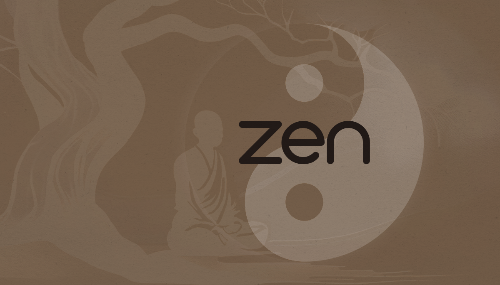

# Zen

Zen is an imperative scripting language that compiles to human-readable [C99](https://en.wikipedia.org/wiki/C99).

### Hello World
```
using System;

namespace Program;

public fun void Main()
{
    Console::WriteLine("Hello from Zen!");
}
```

## Motivation
Zen attempts to be "nice to look at" by my subjective standards. I take aesthetics pretty seriously, and when I can feel "zen" looking at my code, it makes me happy and thus, more productive.

Zen is mostly a "toy language". As in, it shouldn't be used outside simple game scripting for simple video games.

## Features/Design Decisions
As Zen was designed for scripting video game logic, it functions very differently from traditional "systems languages".

Zen is statically and strongly typed.

#### Everything Is Explicitly Defined

Unlike most other C-like languages, in Zen, every variable must have either a `var` or `let` keyword in front of it to signify if the value will change or not.

```
let int one = 1; // This variable is immutable and cannot be changed.
var int two = 2; // This variable is mutable and can be changed.
```

Attempting to modify an immutable variable will result in a compiler error.

#### Access Modifiers

All identifier definitions must have an accessor defined. Zen will not assume either one by default, you have to specify.

```
public struct Vector2
{
    public var float x;
    public var float y;

    public this(let float x, let float y)
    {
        self.x = x;
        self.y = y;
    }
}

private fun int twenty()
{
    return 20;
}
```

#### Memory management
Zen strongly discourages writing dynamic allocations in game logic.